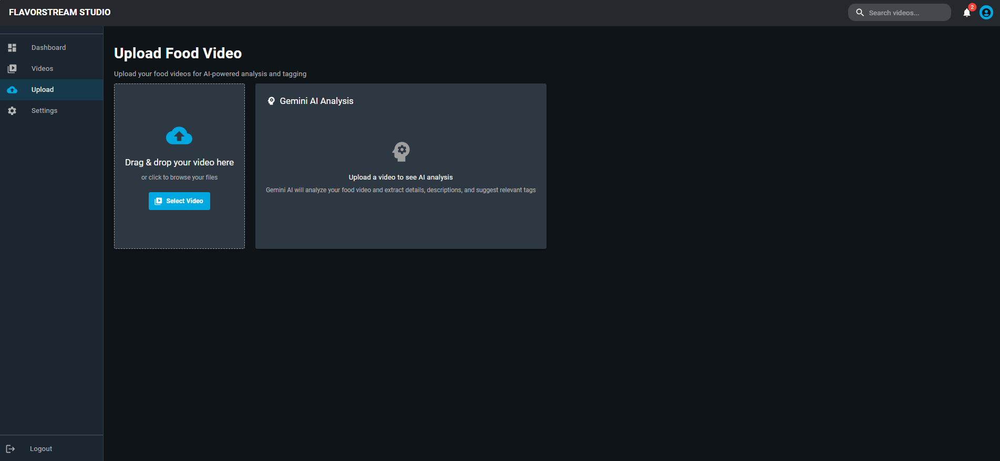

# 🎬 FlavorStream Studio

<div align="center">

**Professional Food Video Content Management Platform**

*An Amazon Prime-inspired admin panel for managing food video content with AI-powered analysis*

[](https://reactjs.org/)
[](https://mui.com/)
[](https://ai.google.dev/)
[](https://opensource.org/licenses/MIT)

</div>

---

## 🌟 Overview

FlavorStream Studio is a cutting-edge content management platform designed specifically for food content creators. Built with modern web technologies and powered by Google's Gemini AI, it provides an intuitive, professional interface for managing video content with intelligent analysis capabilities.

### ✨ Key Highlights

- 🎨 **Amazon Prime-Inspired Design** - Professional dark theme with modern UI/UX
- 🤖 **AI-Powered Analysis** - Automatic video content analysis using Gemini AI
- 📊 **Advanced Analytics** - Comprehensive performance metrics and insights
- 🎯 **Smart Content Management** - Intelligent tagging and categorization
- 📱 **Responsive Design** - Seamless experience across all devices
- ⚡ **High Performance** - Optimized for speed and scalability

## 📸 Screenshots

### Dashboard - Analytics & Overview

*Comprehensive analytics dashboard with performance metrics, charts, and recent video uploads*

### Video Upload - AI-Powered Analysis

*Intelligent video upload interface with AI-powered content analysis and automatic tagging*

### Video Library - Content Management

*Professional video library with advanced filtering, search, and management capabilities*

### Settings - Configuration Panel

*Comprehensive settings panel for account management and system configuration*

## 🚀 Features

### 🎬 Content Management
- **Smart Video Upload** - Drag & drop interface with progress tracking
- **AI Content Analysis** - Automatic title, description, and tag generation
- **Visibility Controls** - Public, Private, and Scheduled publishing options
- **Bulk Operations** - Efficient management of multiple videos
- **Advanced Search** - Powerful filtering and search capabilities

### 📊 Analytics & Insights
- **Performance Metrics** - Views, likes, comments, and engagement tracking
- **Interactive Charts** - Visual representation of content performance
- **Category Analysis** - Content distribution across different categories
- **Trend Monitoring** - Track performance over time

### 🤖 AI Integration
- **Gemini AI Vision** - Advanced video content analysis
- **Smart Tagging** - Automatic tag suggestions based on content
- **Content Optimization** - AI-powered recommendations for better engagement
- **Intelligent Categorization** - Automatic content classification

### 🎨 User Experience
- **Amazon Prime Theme** - Professional, modern interface design
- **Responsive Layout** - Optimized for desktop, tablet, and mobile
- **Dark Mode** - Eye-friendly interface for extended use
- **Intuitive Navigation** - Clean, organized menu structure

## 🛠️ Tech Stack

### Frontend
- **React 19.1.0** - Modern JavaScript library for building user interfaces
- **Material-UI 7.0.2** - React component library with Amazon Prime theming
- **React Router 7.5.0** - Declarative routing for React applications
- **React Hooks** - Modern state management and lifecycle methods

### Data Visualization
- **Recharts 2.15.2** - Composable charting library for React
- **Chart.js 4.4.9** - Simple yet flexible JavaScript charting

### AI & Services
- **Google Gemini AI** - Advanced AI for video content analysis
- **Gemini 2.5 Flash Preview** - Latest AI model for enhanced performance

### Development Tools
- **Create React App** - Modern build toolchain
- **ESLint** - Code quality and consistency
- **Prettier** - Code formatting

## 🚀 Getting Started

### 📋 Prerequisites

Before you begin, ensure you have the following installed:

- **Node.js** (v18.0.0 or higher) - [Download here](https://nodejs.org/)
- **npm** (v8.0.0 or higher) or **yarn** (v1.22.0 or higher)
- **Gemini API Key** - [Get your API key](https://ai.google.dev/)

### 📦 Installation

1. **Clone the repository**
   ```bash
   git clone https://github.com/your-username/flavorstream-studio.git
   cd flavorstream-studio
   ```

2. **Install dependencies**
   ```bash
   npm install
   # or
   yarn install
   ```

3. **Environment Configuration**
   ```bash
   # Create environment file
   cp .env.example .env
   
   # Add your Gemini API key
   echo "REACT_APP_GEMINI_API_KEY=your_api_key_here" >> .env
   ```

4. **Start the development server**
   ```bash
   npm start
   # or
   yarn start
   ```

5. **Open your browser**
   
   Navigate to [http://localhost:3000](http://localhost:3000) to view the application.

### ⚙️ Configuration

#### Gemini AI Setup
1. Visit the [Google AI Studio](https://ai.google.dev/)
2. Generate your API key
3. Add the key to your `.env` file:
   ```env
   REACT_APP_GEMINI_API_KEY=your_actual_api_key_here
   ```

## 🏗️ Build & Deployment

### Production Build
```bash
npm run build
# or
yarn build
```

This creates an optimized production build in the `build` folder, ready for deployment.

## 📁 Project Structure

```
flavorstream-studio/
├── 📁 public/                 # Static assets
├── 📁 src/                   # Source code
│   ├── 📁 components/        # Reusable UI components
│   ├── 📁 pages/             # Application pages
│   ├── 📁 services/          # API services
│   ├── 📁 styles/            # Styling
│   └── 📁 utils/             # Utility functions
├── 📁 screenshots/           # Application screenshots
├── package.json              # Dependencies and scripts
└── README.md                # Project documentation
```

## 🤝 Contributing

We welcome contributions! Please see our [Contributing Guidelines](CONTRIBUTING.md) for details.

## 📄 License

This project is licensed under the MIT License - see the [LICENSE](LICENSE) file for details.

## 🙏 Acknowledgments

- **Amazon Prime Video** - UI/UX design inspiration
- **Google Gemini AI** - Advanced content analysis capabilities
- **Material-UI Team** - Excellent React component library
- **React Community** - Continuous innovation and support

---

<div align="center">

**Made with ❤️ for food content creators**

[⭐ Star this repo](https://github.com/your-username/flavorstream-studio) | [🐛 Report Bug](https://github.com/your-username/flavorstream-studio/issues) | [💡 Request Feature](https://github.com/your-username/flavorstream-studio/issues)

</div>
